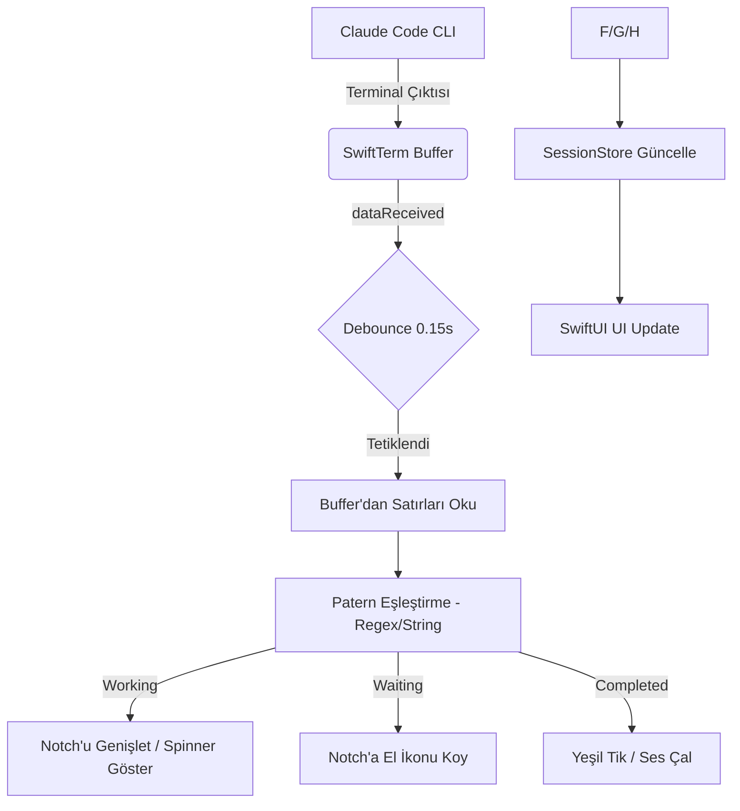

# Claude Code Sinyal Analizi

Bu doküman, Notchy uygulamasının Claude Code CLI aracından gelen durum sinyallerini nasıl yakaladığını ve analiz ettiğini açıklar.

## Genel Mimari

Notchy, Claude Code ile doğrudan bir API veya IPC (Inter-Process Communication) üzerinden haberleşmez. Bunun yerine, terminale basılan metinleri **görsel/metinsel patern eşleşmeleri** kullanarak analiz eder.

### 1. Terminal Emülasyonu (`SwiftTerm`)
Uygulama, `SwiftTerm` kütüphanesini kullanarak bir terminal oturumu başlatır (`TerminalManager.swift`). Claude Code bu terminal içinde çalıştırılır.

### 2. Veri Dinleme (`dataReceived`)
`ClickThroughTerminalView` sınıfı, terminale yeni bir veri geldiğinde tetiklenen `dataReceived` metodunu dinler. 
- Gereksiz yükü önlemek için bu dinleme işlemi **0.15 saniyelik bir debounce** (gecikmeli gruplandırma) ile arka planda çalıştırılır.

### 3. Metin Ayıklama ve Temizleme
Metin analizi yapılmadan önce terminal buffer'ından satırlar okunur:
- **`extractVisibleText()`**: Claude'un çıktılarını kullanıcının giriş alanından ayırmak için terminaldeki ayırıcı çizgiyi (`────────`) arar ve sadece bu çizginin üstündeki metni dikkate alır.

### 4. Durum Tespit Mantığı (`evaluateStatus`)
`TerminalManager.swift` içindeki `evaluateStatus` fonksiyonu, ayıklanan metni şu paternlerle karşılaştırır:

| Durum (Status) | Tespit Yöntemi (Pattern) |
| :--- | :--- |
| **Working (Çalışıyor)** | Metin içinde `·`, `✢`, `✳`, `✶`, `✻`, `✽` gibi spinner karakterlerinin bulunması VEYA "esc to interrupt" yazısının geçmesi. |
| **WaitingForInput (Girdi Bekliyor)** | Metin içinde "Esc to cancel" yazısının bulunması VEYA prompt göstergesi olan `❯` karakterinin yanında bir rakam görülmesi. |
| **Interrupted (Durduruldu)** | Metinde "Interrupted" kelimesinin geçmesi. |
| **Idle (Boşta)** | Yukarıdaki hiçbir paternin eşleşmemesi durumu. |
| **TaskCompleted (Tamamlandı)** | "Idle for X s" gibi süre belirten satırların tespiti (parantez içindeki "thinking" süreleri hariç). |

## Sinyal Akış Diyagramı

## Kritik Gözlemler

1. **API Bağımlılığı Yok**: Claude Code güncellenip terminal çıktı formatını (örneğin spinner karakterlerini veya prompt şeklini) değiştirirse Notchy'nin bu durumları algılaması bozulabilir.
2. **Performans**: Karakter bazlı buffer okuma maliyetli olduğu için işlem `statusQueue` adında düşük öncelikli bir arka plan kuyruğunda yapılır.
3. **Zeki Filtreleme**: Uygulama, kullanıcının o an yazdığı komut ile Claude'un çıktısını karıştırmamak için terminaldeki yatay çizgileri (`separator`) baz alır.

---
*Hazırlayan: Antigravity AI*
